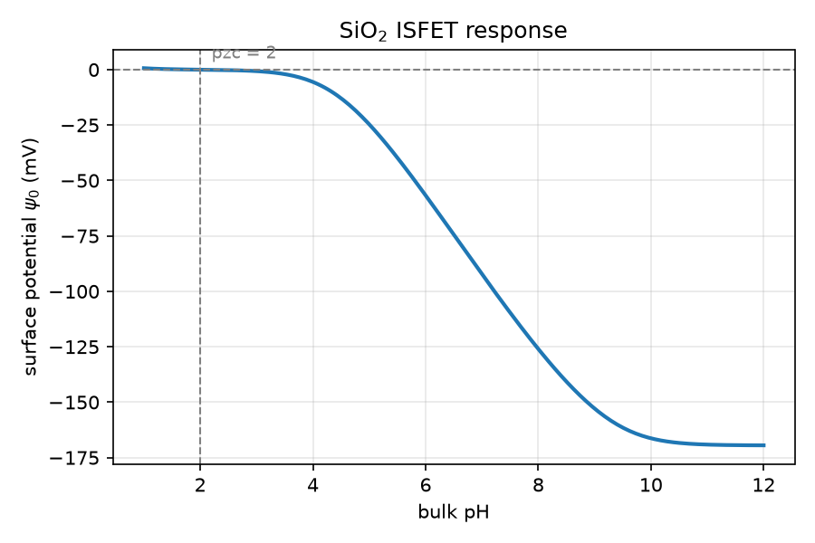
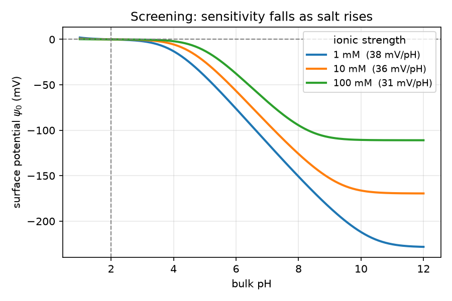

# Biosensor Simulation

Simulates the surface potential of a SiO₂ ISFET as pH changes. Built from the
week 3 nanoHUB material on biosensor sensitivity.

It's also the starting point of the Smoliak et al. BioFET paper (IEEE Sensors
Letters, 2025) — their baseline curve is this model with textbook pK values. So
peptides can be added later without rewriting anything.

## How it works

The thing we want is ψ₀, the surface potential. You can't calculate it directly,
because two things depend on it and both have to agree.

The **surface** is covered in OH groups that hold or drop a proton. How many are
charged depends on pH. That gives a surface charge.

The **solution** answers by pulling in ions of the opposite charge, forming a
cloud near the surface. How much charge that cloud holds depends on ψ₀. That's
Gouy-Chapman.

Protons are charged, so they feel ψ₀ too, which means the surface sits at a
different pH from the bulk. That's what makes it circular — the chemistry needs
ψ₀ before it can work out its own pH.

The way out is that the two charges have to cancel:

```
Q_surface + Q_solution = 0
```

One equation, one unknown. A root finder does the rest, once per pH.

## What it does so far

Sweeps pH from 1 to 12 and plots ψ₀. Sweeps salt concentration too, to show
screening. Five tests check the answers are right.

## Results

### pH response



Crosses zero at pH 2, which is where (pKa + pKb)/2 says it should. Peak slope is
35.7 mV/pH — under the 59 mV/pH limit, and in the 30–45 range real SiO₂ gives.

Nothing in the code mentions either number. The slope comes out of the physics.

### Salt



At 1, 10 and 100 mM the slopes are 38, 36 and 31 mV/pH. The flat ends sit at
−228, −169 and −111 mV.

The flat ends are the better result. Once every site is ionised the charge is
fixed, so ψ₀ only depends on salt, and each 10× in salt should shift it by about
59 mV. The gaps are 59 and 58.

Salt cuts the size of the response much more than it flattens the slope. At this
site density SiO₂ is limited by its buffer capacity rather than by screening.

## Tests

| Check | What it catches |
| --- | --- |
| ψ₀ = 0 at pH 2 | Chemistry, mainly a pKa/pKb mix-up |
| Slope never above 59 mV/pH | Nothing physical breaks this, so it's a bug if it does |
| Slope between 30 and 45 | The two sides are coupled properly |
| `Q₀ = 2·C_DL·V_T` at small ψ₀ | Gouy-Chapman reduces to a plain capacitor as it should |
| Slope falls as salt rises | Screening |

## Files

```
constants.py → analyte.py → charge.py + electrolyte.py → solver.py → sweeps.py → main.py
```

Nothing imports upwards.

| File | What's in it |
| --- | --- |
| `constants.py` | q, k_B, ε₀, N_A |
| `analyte.py` | `Site`, `Analyte`, and the `SIO2` instance |
| `charge.py` | Surface charge and the surface pH shift |
| `electrolyte.py` | `Electrolyte` and the Gouy-Chapman charge |
| `solver.py` | `solve` — needs both sides, so it sits above them |
| `sweeps.py` | The sweeps and the plots |
| `tests/` | Tests only, no model code |

## Running it

```bash
python -m venv .venv
.venv/bin/pip install -r requirements.txt
.venv/bin/python -m pytest
```

## To do

- Stern layer. The lectures stop at Gouy-Chapman, so this one's an addition
- Peptides — longer list of sites, solver shouldn't need to change
- TPSA site blocking, which scales site density by how much room the molecule
  takes up
